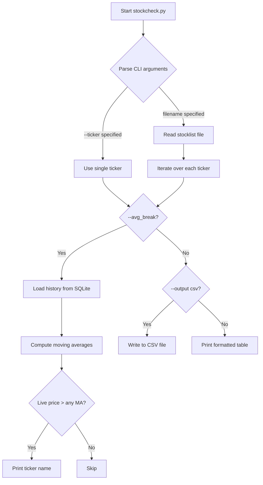
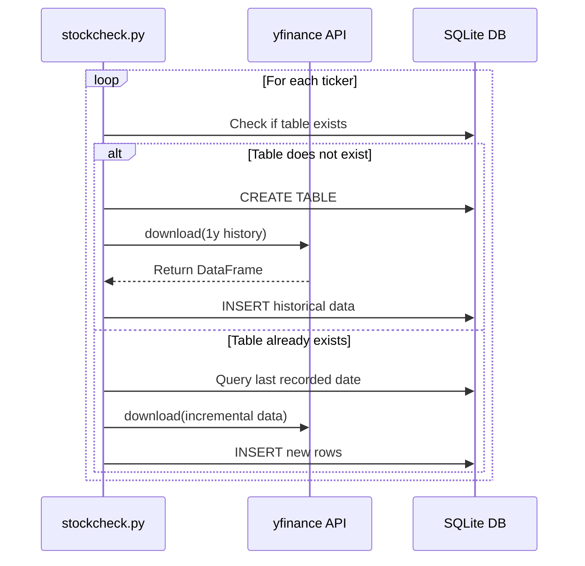

# Software Design Document: `stockcheck.py`

> Iterative SDD — Each phase builds on the previous one. Implement in order.

---

## Table of Contents

1. [Project Overview](#1-project-overview)
   - [1.1 Overall Execution Flow](#11-overall-execution-flow)
2. [Phase 1: Basic Stock Price CLI](#2-phase-1-basic-stock-price-cli)
3. [Phase 2: SQLite Historical Database (`--his_insert`)](#3-phase-2-sqlite-historical-database----his_insert)
   - [3.5 Sequence Diagram](#35-sequence-diagram)
4. [Phase 3: Single Ticker Query (`--ticker`)](#4-phase-3-single-ticker-query----ticker)
5. [Phase 4: Moving Average Breakout Detection (`--avg_break`)](#5-phase-4-moving-average-breakout-detection----avg_break)
6. [Risks & Notes](#6-risks--notes)

---

## 1. Project Overview

**Goal**: Build a Python CLI tool named `stockcheck.py` that fetches live stock prices from Google Finance, with optional support for a local SQLite historical database and basic technical indicator analysis.

**Constraints**:
- Free public data sources only (Google Finance scraping, yfinance)
- No paid APIs
- Dependencies limited to: `requests`, `beautifulsoup4`, `yfinance`, `sqlite3` (stdlib)

### 1.1 Overall Execution Flow

The diagram below shows the full decision path from CLI argument parsing through to final output, covering all four phases.



---

## 2. Phase 1: Basic Stock Price CLI

### 2.1 Requirements

- Accept a `filename` positional argument pointing to a stock list file
- Fetch the live price for each stock from Google Finance
- Print results as a formatted table to stdout
- Optionally write results to a CSV file via `--output csv`

### 2.2 CLI Interface

```bash
python stockcheck.py stocklist.txt
python stockcheck.py stocklist.txt --output csv
```

### 2.3 Input File Format (`stocklist.txt`)

- Plain text, one stock per line in `TICKER:EXCHANGE` format
- Lines starting with `#` are comments; blank lines are ignored

**Example:**
```
# US stocks
MSFT:NASDAQ
AAPL:NASDAQ
GOOGL:NASDAQ

# TW stocks
2330:TPE
2454:TPE
```

### 2.4 Price Fetching Logic

- URL pattern: `https://www.google.com/finance/quote/{TICKER}:{EXCHANGE}`
- Use `requests` for HTTP and `BeautifulSoup` to parse the HTML response
- On failure or missing ticker, print a warning and continue to the next entry

### 2.5 Output Format

**stdout table:**
```
Ticker    Exchange    Price       Currency
------    --------    -----       --------
MSFT      NASDAQ      425.52      USD
2330      TPE         1,050.00    TWD
```

**CSV output (`--output csv`):**
```csv
Ticker,Exchange,Price,Currency
MSFT,NASDAQ,425.52,USD
2330,TPE,1050.00,TWD
```

### 2.6 Dependencies (`requirements.txt`)

```
requests
beautifulsoup4
yfinance
```

---

## 3. Phase 2: SQLite Historical Database (`--his_insert`)

### 3.1 Requirements

Extend Phase 1 with the following:
- Enable database mode with the `--his_insert` flag
- Create a dedicated SQLite table for each ticker (table name = ticker symbol)
- Column schema mirrors the DataFrame returned by `yfinance.download()`
- If the table does **not** exist → create it and download 1 year of history, then insert
- If the table **already exists** → check whether the most recent day's data has been inserted

### 3.2 CLI Interface

```bash
# Live price only (Phase 1 behavior)
python stockcheck.py stocklist.txt

# Enable historical database mode
python stockcheck.py stocklist.txt --his_insert
```

### 3.3 Database Schema

One table per ticker, named after the ticker symbol (e.g., `MSFT`, `stock_2330`):

| Column       | Type    | Description               |
|--------------|---------|---------------------------|
| `Date`       | TEXT    | Date (Primary Key)        |
| `Open`       | REAL    | Opening price             |
| `High`       | REAL    | Daily high                |
| `Low`        | REAL    | Daily low                 |
| `Close`      | REAL    | Closing price             |
| `Adj Close`  | REAL    | Adjusted closing price    |
| `Volume`     | INTEGER | Trading volume            |

> Schema corresponds to `yfinance.download(ticker, period="1y")` output columns.

### 3.4 Logic Flow

```
for each ticker in stocklist:
    if table NOT exists:
        CREATE TABLE {ticker}
        data = yfinance.download(ticker, period="1y")
        INSERT data into table
    else:
        last_date = SELECT MAX(Date) FROM {ticker}
        if last_date != today:
            # Optional: fetch and insert latest day
            WARN "Last record: {last_date}, data may not be up-to-date"
```

### 3.5 Sequence Diagram

The following sequence diagram illustrates the interaction between the CLI, yfinance API, and SQLite DB when `--his_insert` is active.



---

## 4. Phase 3: Single Ticker Query (`--ticker`)

### 4.1 Requirements

Add an optional `--ticker` argument to query a single stock directly from the command line, bypassing the stock list file.

### 4.2 CLI Interface

```bash
python stockcheck.py --ticker MSFT:NASDAQ
```

### 4.3 Behavior

| Scenario                      | Behavior                                                  |
|-------------------------------|-----------------------------------------------------------|
| `--ticker` provided           | Skip `filename` reading; fetch live price for that ticker |
| `--ticker` not provided       | Fall back to Phase 1/2 behavior using `filename`          |
| `--ticker` + `--his_insert`   | `--ticker` takes precedence; database operations skipped  |

> The price-fetching behavior of `--ticker` is identical to processing a single line from the stock list. Output format is the same.

### 4.4 Argument Interaction

- When `--ticker` is active, `filename` is optional (may be omitted)
- When `--ticker` is active, `--his_insert` has no effect

---

## 5. Phase 4: Moving Average Breakout Detection (`--avg_break`)

### 5.1 Requirements

Add an optional `--avg_break` flag that compares each stock's live price against its short-term moving averages and reports breakout signals.

**Argument help string:**
> `"to check if the price of the ticker breaks through its short/mid moving average"`

### 5.2 CLI Interface

```bash
# With stock list file
python stockcheck.py stocklist.txt --avg_break

# With single ticker
python stockcheck.py --ticker MSFT:NASDAQ --avg_break
```

### 5.3 Breakout Logic (`check_avg_break()`)

For each ticker, evaluate the following three conditions:

| MA Period | Source Column | Condition                     |
|-----------|---------------|-------------------------------|
| 5-day     | `Adj Close`   | `live_price > MA5`            |
| 10-day    | `Adj Close`   | `live_price > MA10`           |
| 20-day    | `Adj Close`   | `live_price > MA20`           |

- If **any** condition is `True` → print the ticker name
- If **all** conditions are `False` → skip (no output)

### 5.4 Data Source

> ⚠️ **Moving averages are computed from the local SQLite database**, not fetched from the network, in order to minimize HTTP requests.
>
> **Prerequisite**: The user must have already populated the database using `--his_insert` before invoking `--avg_break`.  
> `check_avg_break()` does **not** validate data completeness or recency. If historical data is missing or stale, the computed averages will be incorrect and may produce false signals.  
> **This is the user's responsibility.** Always run `--his_insert` before using `--avg_break`.

### 5.5 Compatible Modes

`--avg_break` can be combined with either of the following:

1. **List mode**: `python stockcheck.py stocklist.txt --avg_break`
2. **Single ticker mode**: `python stockcheck.py --ticker MSFT:NASDAQ --avg_break`

---

## 6. Risks & Notes

### 6.1 Data Integrity Risks

| Risk                                         | Description                                                                 |
|----------------------------------------------|-----------------------------------------------------------------------------|
| Using `--avg_break` without prior `--his_insert` | MA calculations will use empty or stale data, producing incorrect signals |
| Google Finance HTML structure changes         | The scraping logic may break after page redesigns; BeautifulSoup selectors need periodic maintenance |
| yfinance API instability                      | Intermittent failures may occur; consider adding a retry mechanism          |

### 6.2 Recommended Development Order

```
Phase 1 → Verify scraping works correctly
Phase 2 → Verify DB write and read operations
Phase 3 → Verify --ticker interaction with Phase 1/2
Phase 4 → Verify --avg_break behavior with and without DB data
```

### 6.3 CLI Argument Reference

| Argument       | Type      | Required | Description                                                        |
|----------------|-----------|----------|--------------------------------------------------------------------|
| `filename`     | positional | Conditional | Path to stock list file (optional when `--ticker` is active)  |
| `--output csv` | flag      | No       | Write results to a CSV file instead of stdout                      |
| `--his_insert` | flag      | No       | Enable SQLite database mode (download or update historical data)   |
| `--ticker`     | value     | No       | Query a single stock (`TICKER:EXCHANGE` format); bypasses list     |
| `--avg_break`  | flag      | No       | Compare live price to MA5/MA10/MA20; print tickers that break through |